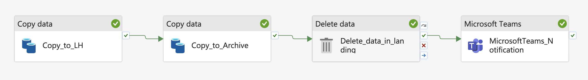
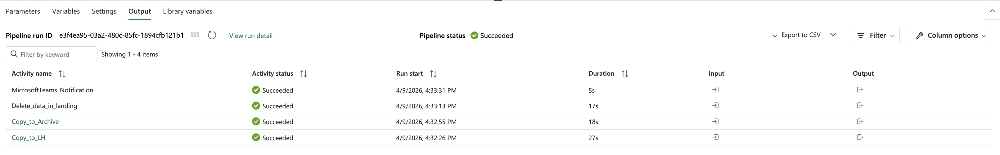
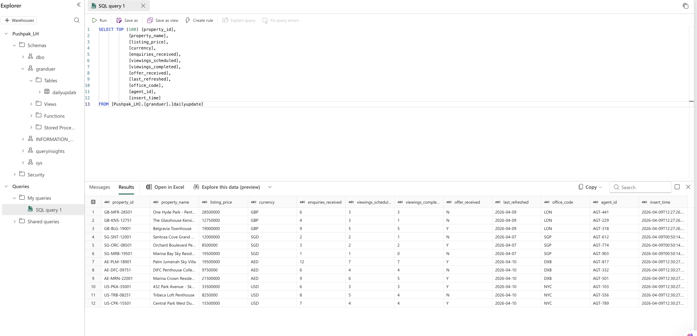
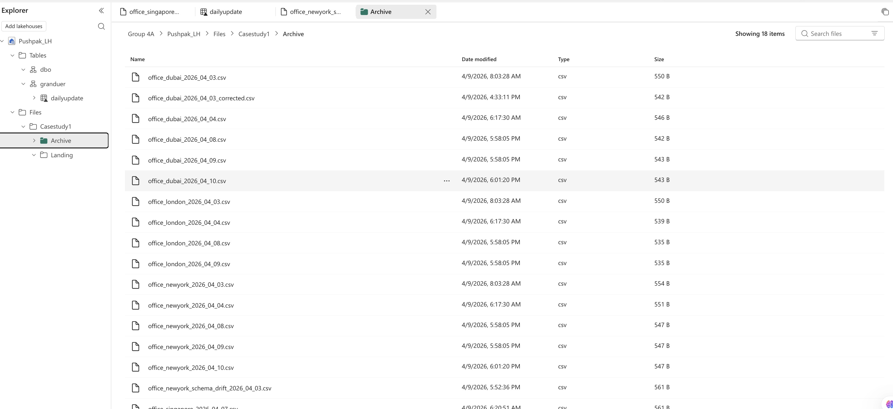
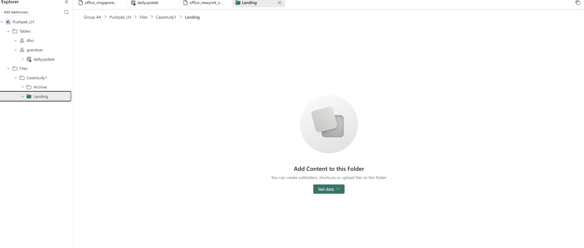
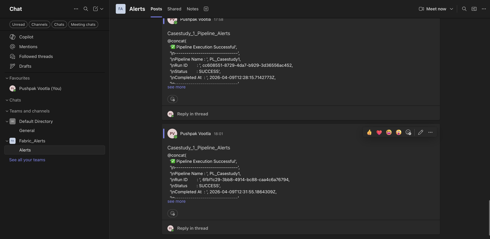

# Grandeur Properties Global Listing Intelligence Pipeline

## Project Overview

This project is a Microsoft Fabric case study that demonstrates how to build a reliable property listing ingestion pipeline for a global real estate business. The solution automates the ingestion of office-generated CSV extracts using the wildcard pattern `office_*.csv`, loads curated data into a Lakehouse table, and applies incremental updates using an Upsert strategy keyed on `property_id`.

The pipeline is designed for production-style data operations, with a focus on data quality, repeatable ingestion, privacy-conscious processing, and controlled file lifecycle management. It also enriches each loaded record with a pipeline ingestion timestamp to improve auditability and downstream traceability.

## Business Problem

Grandeur Properties operates across multiple offices that generate periodic CSV exports of property listings. Manual ingestion of these files creates several operational issues:

- Duplicate or overwritten records when files contain updates to existing properties
- Limited visibility into when data was received and loaded
- Risk of exposing personally identifiable information (PII) in analytics environments
- Accumulation of processed files in landing zones, increasing storage clutter and reprocessing risk
- Inconsistent ingestion patterns across offices and reporting cycles

The business needed a standardized Microsoft Fabric pipeline that could ingest files from multiple offices, merge new and changed records into a single trusted Lakehouse table, and manage file archival and cleanup in a controlled way.

## Architecture

The solution follows a simple medallion-style ingestion pattern within Microsoft Fabric:

1. Source files arrive in a landing area as office-specific CSV extracts matching `office_*.csv`.
2. The pipeline reads the matching files and applies schema-aligned ingestion rules.
3. Selected business columns are loaded into a Lakehouse table, while PII columns are excluded from the analytics layer.
4. Records are merged into the target table using Upsert logic with `property_id` as the business key.
5. A pipeline ingestion timestamp is added to each processed record for operational lineage.
6. Successfully processed files are moved to an archive location.
7. Files are deleted from the landing zone only after archive success is confirmed.

At a high level, the architecture separates ingestion, curation, and operational file handling so that analytics users work from a clean and controlled Lakehouse dataset.

## Tools and Technologies

- Microsoft Fabric Data Factory for orchestration
- Microsoft Fabric Lakehouse for curated storage
- CSV source files from distributed offices
- Upsert/merge logic using `property_id` as the primary match key
- File pattern-based ingestion using `office_*.csv`
- Operational metadata enrichment with pipeline ingestion timestamp

## How to Replicate in Microsoft Fabric

Use the exported pipeline JSON in `pipeline-json/pl_casestudy_1.json` as a reference implementation, then replace the environment-specific placeholders before publishing or re-creating the pipeline in your own Fabric workspace.

### Prerequisites

- A Microsoft Fabric workspace with Data Factory and Lakehouse access
- A Lakehouse with a `grandeur.dailyupdate` target table
- Lakehouse file folders for landing, archive, and quarantine handling
- A Microsoft Teams connection if you want the notification step enabled

### Replace These Placeholders

- `<workspace-id>`: the target Microsoft Fabric workspace ID
- `<lakehouse-id>`: the Lakehouse artifact ID used for both `Files` and `Tables`
- `<object-id>`: the pipeline object ID in the exported JSON
- `<user-id>`: the user or service principal that last modified the pipeline
- `<team-id>`: the Microsoft Teams team ID for notifications
- `<channel-id>`: the Microsoft Teams channel ID for notifications
- `<connection-id>`: the Microsoft Teams connection reference used by the activity

### Fabric Setup Checklist

1. Create or identify the Lakehouse that will host the solution.
2. Create the target table `grandeur.dailyupdate` with the expected schema, including `property_id` and `insert_time`.
3. Create the Lakehouse file folders used by the pipeline.
4. Recommended production layout:
   - `Casestudy1/Landing/Incoming`
   - `Casestudy1/Archive/Processed`
   - `Casestudy1/Quarantine/Unexpected`
5. In the Copy activity, add `insert_time` as an additional column using `@utcNow()`.
6. Import mappings from a representative `office_*.csv` file, then keep those mappings while switching the file name to dynamic content.
7. Configure the Microsoft Teams activity with dynamic content for pipeline name, pipeline ID, run ID, execution time, and status.

### Operational Notes

- Only files matching `office_*.csv` should be ingested into the Lakehouse table.
- Unexpected or non-conforming files should be routed to quarantine rather than the trusted archive path.
- Landing-zone deletion should happen only after a successful archive or quarantine move.
- If you do not want Teams alerts in your environment, disable or remove the notification activity after import.

## Pipeline Flow

1. Monitor or trigger ingestion for incoming office CSV files in the landing zone.
2. Read all matching files using the wildcard pattern `office_*.csv`.
3. Validate expected structure and select only approved columns for ingestion.
4. Exclude PII-related attributes from the target analytics dataset.
5. Add a pipeline ingestion timestamp to every incoming record.
6. Load data into the Microsoft Fabric Lakehouse target table.
7. Perform Upsert logic using `property_id` to insert new records and update existing ones.
8. Move processed files to the archive location.
9. Delete files from the landing zone only after archive completion succeeds.

## Key Features

- Automated multi-file ingestion with wildcard-based file selection
- Incremental load design using Upsert instead of full reloads
- Business-key matching with `property_id`
- Built-in ingestion timestamp for auditability and operational tracking
- Privacy-aware design through exclusion of PII columns
- File archival to support traceability and reprocessing controls
- Safe landing-zone cleanup dependent on archive success
- Portfolio-ready pattern that mirrors real enterprise data engineering requirements

## Validation Performed

The pipeline design was validated against the following scenarios:

- Confirmed that only files matching `office_*.csv` are picked up
- Verified that new property records are inserted into the Lakehouse table
- Verified that existing property records are updated correctly through Upsert using `property_id`
- Confirmed that ingestion timestamp values are populated for all loaded records
- Checked that PII columns are excluded from the target table
- Confirmed that processed files are archived successfully
- Verified that landing-zone file deletion occurs only after archive success
- Reviewed rerun behavior to reduce duplicate processing risk

For a repeatable execution guide, see [Validation Playbook](./docs/validation-playbook.md) and [SQL Checks](./sql/validation_queries.sql).

## Design Challenges

- Managing incremental updates from multiple office extracts without creating duplicate listings
- Preserving a clean analytical dataset while excluding sensitive columns
- Ensuring file cleanup logic did not create data loss risk
- Balancing a simple case study design with enterprise-style operational controls
- Keeping the pipeline understandable for portfolio presentation while still reflecting realistic data engineering practices

## Key Learnings

- Upsert-based ingestion is essential when source files contain both new and modified business entities
- Adding operational metadata such as ingestion timestamp significantly improves traceability
- Privacy controls should be embedded directly in pipeline design, not treated as a downstream cleanup step
- Archive-first deletion logic is a practical safeguard for file-based ingestion patterns
- Microsoft Fabric provides a strong foundation for combining orchestration and Lakehouse-based analytics in a single solution

## Future Improvements

- Add schema drift handling and stronger data quality checks
- Introduce pipeline alerts and operational monitoring for failures
- Capture row-level rejection logs for invalid records
- Expand the design to support partitioning and higher-volume ingestion
- Add parameterization for region, office, and environment-specific deployments
- Integrate downstream Power BI reporting on curated Lakehouse data

## Screenshots

### Pipeline Design

### Successful Execution

### Lakehouse Output

### Archive & Cleanup

### Teams Notification

---
Sensitive identifiers (workspace, connections, teams) are masked for security.

## Conclusion
This case study highlights how Microsoft Fabric can be used to build a practical, enterprise-style ingestion pipeline for global property listing data with strong attention to auditability, privacy, and operational reliability.
